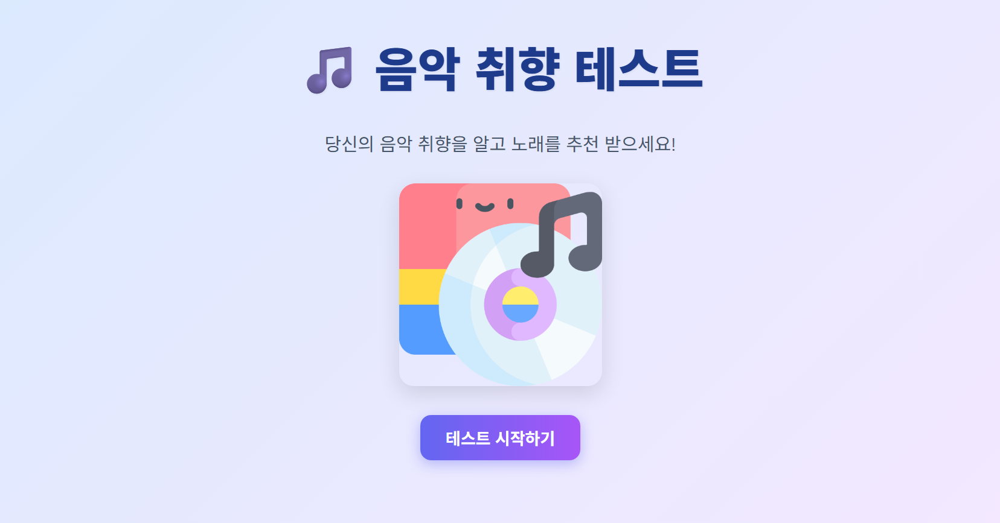
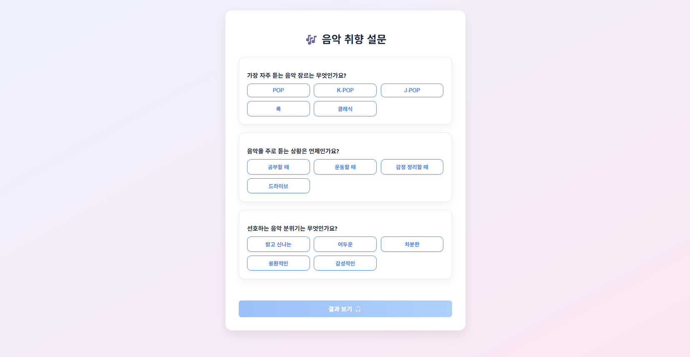
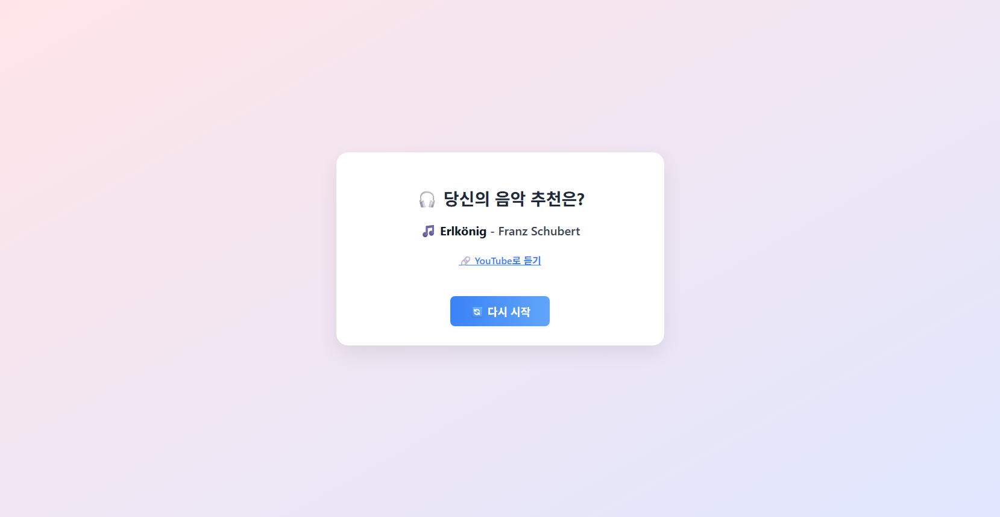

# 음악 취향 진단 웹사이트

## 소개
 > 음악 취향을 진단해주고 이에 맞는 음악을 추천해주는 React 웹 사이트

---

## 사용된 기술 스택

    
    

> React & CSS

---

## 페이지 화면

### Main page

    

> 테스트 시작하기 버튼을 누르면 Survey page로 이동

 

### Survey page

    

> 세가지 질문을 주고 이에 대해 버튼으로 선택지를 누르도록 함
> 결과보기 버튼을 누르면 Result page로 이동동

 

### Result page

    

> Survey page에서 선택했던 결과를 바탕으로 음악 추천과 함께 유튜브 링크 제공
> 다시 시작 버튼을 누르면 Main page로 이동

